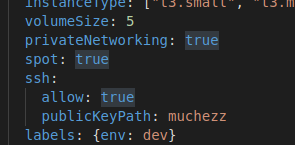
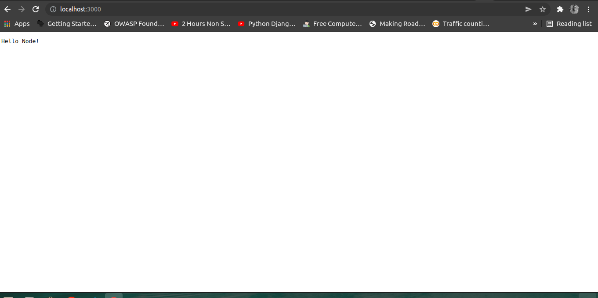
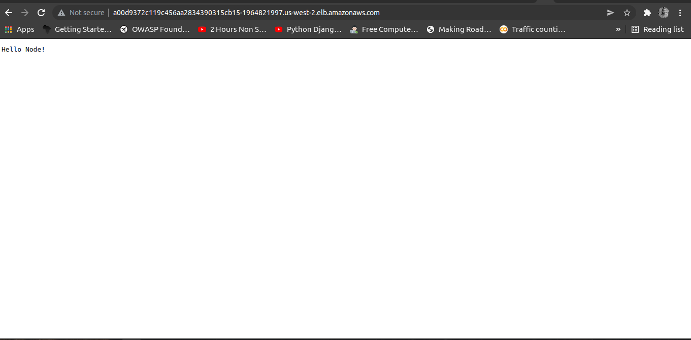

## Adding CICD to the project with Github actions

 Create an EKS cluster using eksctl with using spot instances and enabling ssh access and then auto deploy the newly built image from ECR to the cluster in a namespace called "development"

 - Created aws eks cluster with eksctl with this line of code `eksctl create cluster -f create-cluster.yml`

 - Created a  spot ec2 instances with ssh capabilities as show 
    
- Define a namespace Development where the cluster was created with [this](./k8s/nm.yml)

- App running locally 

- App running in Elb 

Link to app on [elb](http://a00d9372c119c456aa2834390315cb15-1964821997.us-west-2.elb.amazonaws.com/)

### What to do better

- Better implementation of ssh capababilites
- Use a service such as AWS Fargate for better cluster management